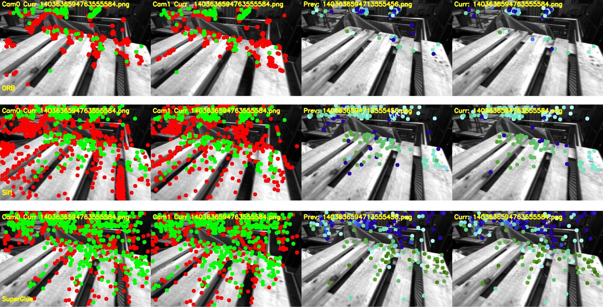

# SuperGlue-Based Stereo Feature Matching



## Overview

This repository demonstrates the advantages of using the SuperGlue algorithm for stereo feature matching. Unlike traditional methods, SuperGlue eliminates the need for detecting feature points separately in both cameras. Instead, it identifies feature points in the first camera and directly matches them to the second camera, leading to higher triangulation point counts and improved matching accuracy.

## Key Features

- **Unified Feature Matching**: Features are detected in one camera and matched in the other, simplifying the matching process and improving robustness.
- **High Matching Accuracy**: Leveraging SuperGlue ensures superior matching precision compared to traditional methods like ORB and SIFT.
- **Temporal Matching**: Enables the use of matched points for temporal consistency across frames.

## Visual Comparisons

- **SuperGlue Statistical Comparison**: See [Superglue_bar.png](Superglue_bar.png) for a detailed comparison against traditional algorithms.

## Getting Started

### Prerequisites

Ensure you have Python and the required dependencies installed. Below are the necessary libraries:

```bash
pip install torch torchvision torchaudio --index-url https://download.pytorch.org/whl/cu118
pip install opencv-python-headless matplotlib pandas pyyaml
```

### Dataset Preparation

1. Download the Euroc MAV dataset from [here](https://projects.asl.ethz.ch/datasets/doku.php?id=kmavvisualinertialdatasets).
2. Extract the dataset and place it in the appropriate folder structure. For example:
   ```
   dataset_root/
   ├── MH_01_easy/
       ├── mav0/
           ├── cam0/
               ├── data.csv
               ├── sensor.yaml
           ├── cam1/
               ├── data.csv
               ├── sensor.yaml
   ```

   Update the `base_path` and `sequence` variables directly in the scripts as shown below:

   ```python
   base_path = "<dataset_root>"
   sequence = "MH_01_easy"
   ```

   Replace `<dataset_root>` with the path to your dataset.

### Running the Code

1. Clone this repository:
   ```bash
   git clone https://github.com/ufukasia/SuperGlue-Stereo-and-Temporal-Matching-Comparison.git
   cd SuperGlue-Stereo-and-Temporal-Matching-Comparison
   ```

2. Execute the SuperGlue feature matching script:
   ```bash
   python superglue.py
   ```

### Output

- Results will be saved in the `results_super` directory as CSV files.
- Visualizations will be stored in the `visualizations_super` directory.

## Comparison with Other Algorithms

### ORB-Based Feature Matching
To test the ORB-based method, update the `base_path` and `sequence` variables in `orb.py`, then run:

```bash
python orb.py
```

### SIFT-Based Feature Matching
To test the SIFT-based method, update the `base_path` and `sequence` variables in `sift.py`, then run:

```bash
python sift.py
```

## Results

- **SuperGlue** achieves a significantly higher number of matched and triangulated points compared to ORB and SIFT.
- Visualizations and statistics highlight the advantage of using SuperGlue for stereo matching.

## License

This project is licensed under the MIT License.
